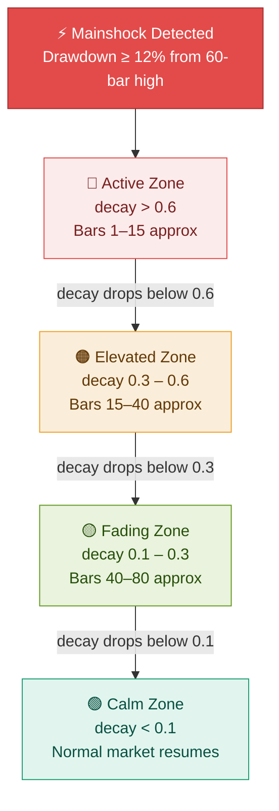
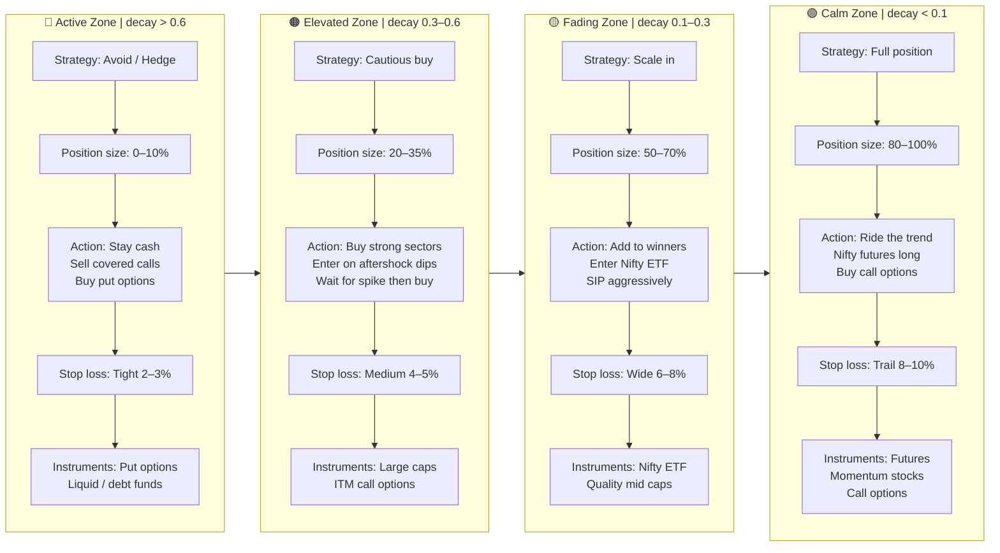
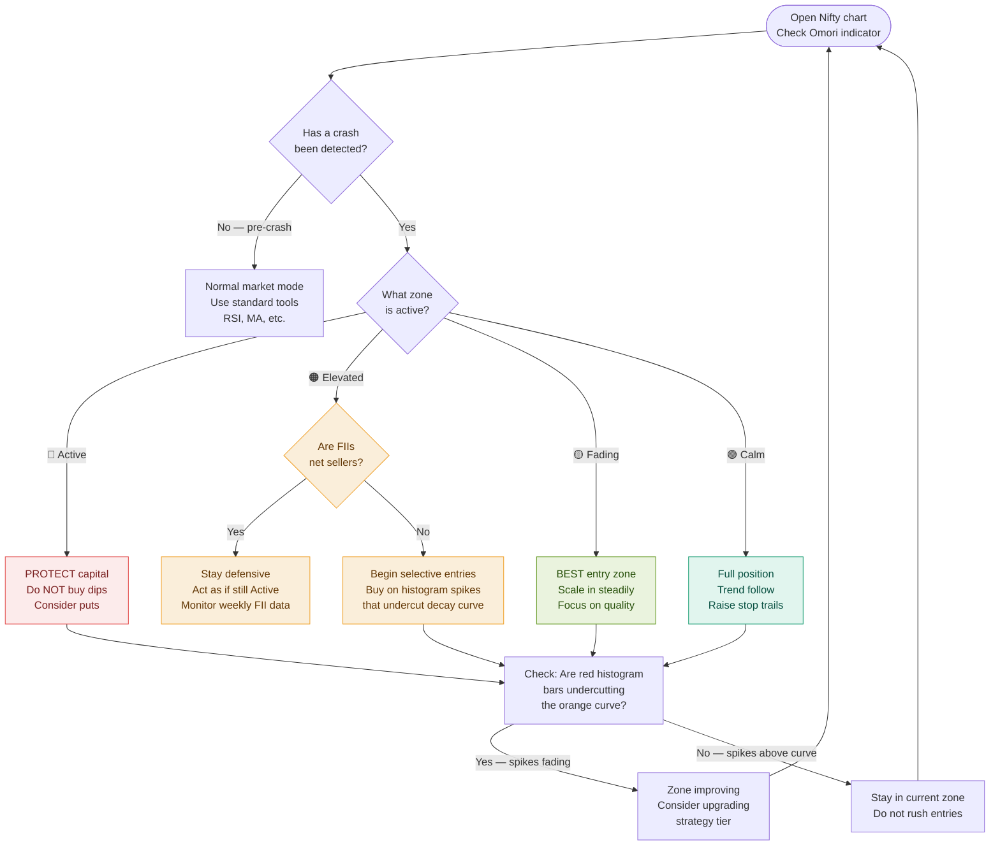

# Omori Law — Nifty 50 Trading Strategy

> **Disclaimer:** This is a research-based analytical framework, not financial advice. Always use proper risk management and never risk capital you cannot afford to lose.

---

## What is Omori Law?

Omori's Law comes from seismology. After a major earthquake, aftershocks decay in frequency following a power law:

$$n(t) = \frac{K}{(t + c)^p}$$

| Symbol | Name | Meaning in Markets |
|--------|------|--------------------|
| `n(t)` | Aftershock rate | Volatility level at time `t` after crash |
| `K` | Productivity | Severity/energy of the crash |
| `c` | Time offset | Early-phase smoothing constant |
| `p` | Decay exponent | How fast volatility normalizes |
| `t` | Time since crash | Trading bars elapsed since mainshock |

The idea: a market crash is the **mainshock**, and subsequent volatility spikes are **aftershocks** that decay predictably over time.

---

## Nifty 50 — Indicator Parameters

These are the calibrated values for NSE:NIFTY on the **Daily (1D)** timeframe.

### Crash Detection

| Parameter | Value | Reason |
|-----------|-------|--------|
| Mainshock Threshold | `12%` | Nifty has routine 8–10% corrections; 12%+ signals a true crash |
| Lookback for Recent High | `60 bars` | ~3 months of daily bars to define the "peak" |

### Omori Law Parameters

| Parameter | Value | Reason |
|-----------|-------|--------|
| K – Productivity | `1.2` | Moderate scaling; Nifty crashes are severe but not S&P-level liquid |
| c – Time Offset | `2.0` | Wider early smoothing due to circuit breakers and auction-open gaps |
| p – Decay Exponent | `0.70` | **Key parameter.** Emerging market memory effect — aftershocks linger longer than developed markets |

### Volatility / Aftershock Settings

| Parameter | Value | Reason |
|-----------|-------|--------|
| ATR Period | `20` | Standard 1-month rolling ATR |
| Aftershock Spike Multiplier | `1.8` | 1.8× average ATR = confirmed spike; filters out noise |

### p-value Guide by Crash Type

| Crash Type | Recommended `p` | Example |
|------------|-----------------|---------|
| Global contagion | `0.60 – 0.75` | COVID Mar 2020, GFC 2008 |
| Domestic shock | `0.80 – 0.90` | Election result, RBI surprise |
| Flash crash / single-day spike | `1.10 – 1.30` | Budget day panic |
| Sustained bear market | `0.50 – 0.65` | 2008 full bear, 2015–16 slowdown |

> **Tuning rule:** If the red histogram spikes outlast the orange decay curve → lower `p`. If the curve stays elevated after spikes die → raise `p`.

---

## The Four Seismic Zones

The indicator divides post-crash time into four zones based on the decay value:



---

## Trading Strategy by Zone



---

## Decision Flow — What to Do Right Now



---

## The Golden Rule

> **Never fight the aftershocks.**
>
> The red histogram (actual volatility) tells the truth. The orange Omori decay curve tells you the *expected* rate of decay.
>
> - If red spikes **outlast** the orange curve → the market has more structural damage than the model predicted. Stay defensive longer. Lower your `p`.
> - If red spikes **undercut** the orange curve → the market is healing faster than expected. This is your green light to start scaling in.
> - The **gap between actual and predicted** is the signal. Not the price. Not the news.

---

## Nifty-Specific Adjustments

### FII Flow Override
The Omori model captures **volatility decay** but not **capital flow dynamics**. When transitioning from Elevated → Fading zone, always cross-check:

- If FIIs are **net sellers** week-on-week → treat the zone as one level more defensive
- If FIIs are **net buyers** → trust the Omori signal; accelerate entries

### Circuit Breaker Gap
Nifty's 10%/15% circuit breakers mean the first day of a crash is often distorted. The `c = 2.0` parameter handles this — it smooths the first 2 bars after the mainshock so the decay curve doesn't overfit to the halt noise.

---

## Historical Test Cases

| Crash | Date | Drawdown | Suggested p | Zone Duration |
|-------|------|----------|-------------|---------------|
| COVID crash | Feb–Mar 2020 | ~38% | `0.65` | Active: ~15 bars |
| GFC | Jan 2008–Mar 2009 | ~60% | `0.60` | Multiple mainshocks |
| China spillover | Aug–Sep 2015 | ~16% | `0.80` | Active: ~8 bars |

> **Test tip:** In TradingView, use the date range bar to jump to these periods. Observe whether the orange decay curve envelope matches the rhythm of the red histogram spikes. Tune `p` until they align.

---

## Quick Reference Card

```
INDICATOR: Omori Law (omori_law_market.pine)
CHART:     NSE:NIFTY — Daily (1D)

━━━━━━━━━━━━━━━━━━━━━━━━━━━━━━━━━━━
PARAMETER              VALUE
━━━━━━━━━━━━━━━━━━━━━━━━━━━━━━━━━━━
Mainshock Threshold    12%
Lookback High          60 bars
K – Productivity       1.2
c – Time Offset        2.0
p – Decay Exponent     0.70  ← tune this
ATR Period             20
Aftershock Multiplier  1.8
━━━━━━━━━━━━━━━━━━━━━━━━━━━━━━━━━━━

ZONE      DECAY     SIZE    ACTION
━━━━━━━━━━━━━━━━━━━━━━━━━━━━━━━━━━━
🔴 Active  > 0.6    0–10%   Protect / hedge
🟠 Elevated 0.3–0.6 20–35%  Cautious entries
🟡 Fading  0.1–0.3  50–70%  Scale in (best zone)
🟢 Calm    < 0.1   80–100%  Full deployment
━━━━━━━━━━━━━━━━━━━━━━━━━━━━━━━━━━━
```

---

*Strategy developed using Omori's Law (1894) applied to financial markets. Cross-reference with FII flow data, sector rotation, and macro context before executing trades.*
